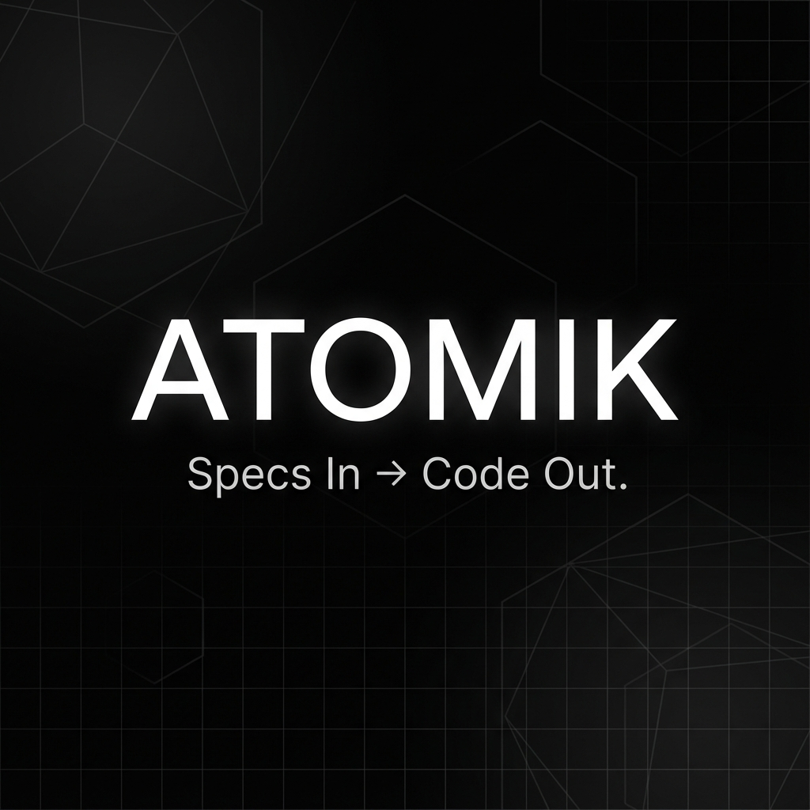

# Atomik Landing Page

[](https://atomik.dev)
[](https://nextjs.org/)
[](https://www.typescriptlang.org/)
[](https://tailwindcss.com/)

> **Specs In → Code Out** — The official landing page for Atomik, a platform that turns ideas into scoped, test-verified tasks and delivers production-ready code through vetted developers.



---

## ✨ Features

- **Next.js 16** with App Router and Turbopack for blazing-fast development
- **Static Export** optimized for Netlify deployment
- **Framer Motion** animations with scroll-reveal effects
- **Netlify Forms** integration for waitlist and investor contact
- **UTM & Attribution Tracking** built-in analytics without external tools
- **SEO Optimized** with Open Graph, Twitter Cards, and JSON-LD structured data
- **Fully Responsive** design with mobile-first approach
- **Accessibility** compliant with sr-only labels and ARIA attributes

---

## 🚀 Quick Start

### Prerequisites

- Node.js 18.17 or later
- npm, yarn, or pnpm

### Installation

```bash
# Clone the repository
git clone https://github.com/medkhalilkhamassi/atomik-landing.git
cd atomik-landing

# Install dependencies
npm install

# Start development server
npm run dev
```

Open [http://localhost:3000](http://localhost:3000) to view the site.

### Build for Production

```bash
npm run build
```

This generates a static export in the `out/` directory, ready for deployment.

---

## 📁 Project Structure

```
src/
├── app/                          # Next.js App Router pages
│   ├── layout.tsx                # Root layout with Netlify form definitions
│   ├── page.tsx                  # Home page composition
│   ├── success/                  # Form submission success page
│   ├── privacy/                  # Privacy policy
│   └── terms/                    # Terms of service
├── components/
│   ├── layout/                   # Layout components
│   │   ├── SiteHeader.tsx        # Navigation header
│   │   ├── Footer.tsx            # Site footer
│   │   └── SideNavigation.tsx    # Scroll spy navigation
│   ├── sections/                 # Page sections
│   │   ├── Hero/
│   │   │   ├── HeroSection.tsx   # Main hero with waitlist/investor overlays
│   │   │   └── HeroGeometricBackground.tsx
│   │   ├── Manifesto/
│   │   │   ├── ManifestoSection.tsx
│   │   │   └── SpatialProblemShowcase.tsx
│   │   ├── Agents/
│   │   │   ├── AgentsSection.tsx
│   │   │   └── TestimonialSlider.tsx
│   │   └── FAQ/
│   │       └── FAQSection.tsx
│   ├── forms/
│   │   └── InvestorContactForm.tsx
│   └── ui/
│       ├── buttons/              # Button components
│       ├── motion/               # Animation utilities
│       └── primitives/           # Base UI components
├── lib/
│   ├── utils.ts                  # Utility functions (cn, etc.)
│   └── attribution.ts            # UTM parsing helper
└── styles/
    └── globals.css               # Global styles and Tailwind config
```

---

## 🔧 Configuration

### Environment Variables

No environment variables are required for the landing page. All configuration is handled through the codebase.

### Netlify Forms

The site uses Netlify Forms for data collection. Two forms are configured:

1. **Waitlist** (`waitlist`) — Email capture for early access
2. **Investor Contact** (`investor-contact`) — Full contact form for investors

Hidden form definitions are in `src/app/layout.tsx` for Netlify detection.

### Analytics

UTM parameters and CTA source tracking are captured automatically:
- `utm_source`, `utm_medium`, `utm_campaign`, `utm_term`, `utm_content`
- `referrer`, `landing_path`, `cta_source`, `submitted_at`

See `docs/metrics.md` for analysis instructions.

---

## 🎨 Design System

The site uses a custom dark theme with the following key tokens:

| Variable | Description |
|----------|-------------|
| `--background` | Page background |
| `--foreground` | Primary text |
| `--primary` | Accent color |
| `--muted-foreground` | Secondary text |
| `--border` | Border color |

All components use Tailwind CSS with the `cn()` utility for conditional classes.

---

## 📦 Tech Stack

| Technology | Purpose |
|------------|---------|
| [Next.js 16](https://nextjs.org/) | React framework with App Router |
| [TypeScript](https://www.typescriptlang.org/) | Type safety |
| [Tailwind CSS 4](https://tailwindcss.com/) | Utility-first styling |
| [Framer Motion](https://www.framer.com/motion/) | Animations |
| [Lucide React](https://lucide.dev/) | Icon library |
| [Netlify](https://www.netlify.com/) | Hosting & Forms |

---

## 🚢 Deployment

The site is configured for automatic deployment on Netlify via GitHub integration.

### Manual Deploy

```bash
# Build the site
npm run build

# Deploy to Netlify (requires Netlify CLI)
netlify deploy --prod --dir=out
```

### Deploy Settings

| Setting | Value |
|---------|-------|
| Build command | `npm run build` |
| Publish directory | `out` |
| Node version | `18.x` |

---

## 📄 Pages

| Route | Description |
|-------|-------------|
| `/` | Main landing page with hero, manifesto, agents, and FAQ |
| `/success` | Form submission confirmation |
| `/privacy` | Privacy policy |
| `/terms` | Terms of service |

---

## 🤝 Contributing

1. Fork the repository
2. Create a feature branch (`git checkout -b feature/amazing-feature`)
3. Commit your changes (`git commit -m 'Add amazing feature'`)
4. Push to the branch (`git push origin feature/amazing-feature`)
5. Open a Pull Request

---

## 📜 License

This project is proprietary. All rights reserved by Atomik.

---

## 📧 Contact

- **Website**: [https://atomik.dev](https://atomik.dev)
- **Email**: [hello@atomik.dev](mailto:hello@atomik.dev)

---

<p align="center">
  Built with ❤️ by the Atomik team
</p>
